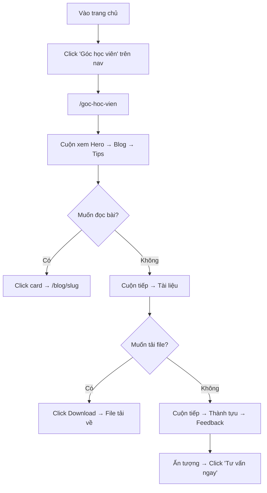
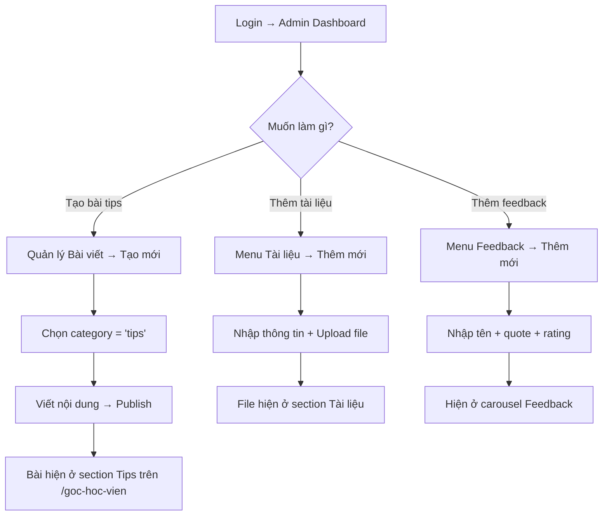

# 🎨 DESIGN: Góc Học Viên (Student Hub) - Miora Académie

Ngày tạo: 2026-04-11
Dựa trên: [SPECS](specs/student_hub_spec.md) | [Plan](../plans/260411-0933-student-hub/plan.md)

---

## 1. Cách Lưu Thông Tin (Database)

### 1.1. Bảng `posts` (MỞ RỘNG)

Thêm 1 cột vào bảng đã có:

```sql
ALTER TABLE posts ADD COLUMN category text NOT NULL DEFAULT 'blog';
-- Giá trị: 'blog' | 'tips' | 'news'

CREATE INDEX idx_posts_category ON posts(category);
```

### 1.2. Bảng `resources` (MỚI)

```sql
CREATE TABLE resources (
  id uuid PRIMARY KEY DEFAULT gen_random_uuid(),
  title text NOT NULL,
  description text,
  file_url text NOT NULL,
  file_type text NOT NULL DEFAULT 'pdf',     -- 'pdf' | 'audio' | 'doc' | 'other'
  file_size text,                             -- VD: "2.5 MB"
  download_count integer NOT NULL DEFAULT 0,
  is_active boolean NOT NULL DEFAULT true,
  created_at timestamptz NOT NULL DEFAULT now()
);
```

### 1.3. Bảng `testimonials` (MỚI)

```sql
CREATE TABLE testimonials (
  id uuid PRIMARY KEY DEFAULT gen_random_uuid(),
  student_name text NOT NULL,
  avatar_url text,
  course text,                                -- VD: "DELF B1"
  quote text NOT NULL,
  rating integer NOT NULL DEFAULT 5 CHECK (rating >= 1 AND rating <= 5),
  is_active boolean NOT NULL DEFAULT true,
  display_order integer NOT NULL DEFAULT 0,
  created_at timestamptz NOT NULL DEFAULT now()
);
```

### 1.4. Bảng `achievements` (MỚI)

```sql
CREATE TABLE achievements (
  id uuid PRIMARY KEY DEFAULT gen_random_uuid(),
  student_name text NOT NULL,
  avatar_url text,
  achievement text NOT NULL,                 -- VD: "DELF B2 - 85/100"
  description text,
  year text,                                  -- VD: "2025"
  is_active boolean NOT NULL DEFAULT true,
  display_order integer NOT NULL DEFAULT 0,
  created_at timestamptz NOT NULL DEFAULT now()
);
```

### 1.5. RLS Policies

```sql
-- resources: public đọc, admin ghi
ALTER TABLE resources ENABLE ROW LEVEL SECURITY;
CREATE POLICY "Public read resources" ON resources FOR SELECT USING (true);
CREATE POLICY "Admin insert resources" ON resources FOR INSERT TO authenticated WITH CHECK (true);
CREATE POLICY "Admin update resources" ON resources FOR UPDATE TO authenticated USING (true);
CREATE POLICY "Admin delete resources" ON resources FOR DELETE TO authenticated USING (true);

-- testimonials: tương tự
ALTER TABLE testimonials ENABLE ROW LEVEL SECURITY;
CREATE POLICY "Public read testimonials" ON testimonials FOR SELECT USING (true);
CREATE POLICY "Admin insert testimonials" ON testimonials FOR INSERT TO authenticated WITH CHECK (true);
CREATE POLICY "Admin update testimonials" ON testimonials FOR UPDATE TO authenticated USING (true);
CREATE POLICY "Admin delete testimonials" ON testimonials FOR DELETE TO authenticated USING (true);

-- achievements: tương tự
ALTER TABLE achievements ENABLE ROW LEVEL SECURITY;
CREATE POLICY "Public read achievements" ON achievements FOR SELECT USING (true);
CREATE POLICY "Admin insert achievements" ON achievements FOR INSERT TO authenticated WITH CHECK (true);
CREATE POLICY "Admin update achievements" ON achievements FOR UPDATE TO authenticated USING (true);
CREATE POLICY "Admin delete achievements" ON achievements FOR DELETE TO authenticated USING (true);
```

### 1.6. Supabase Storage

```
Bucket mới: "resources" (public)
- Cho phép upload: PDF, DOC, MP3, WAV, ZIP
- Max file size: 50MB
```

---

## 2. Danh Sách Màn Hình (Public)

| # | Route | Mục đích | Kiểu component |
|---|-------|----------|----------------|
| 1 | `/goc-hoc-vien` | Trang hub tổng hợp 6 sections | Server Component |

### 2.1. Chi tiết các Sections

#### Section 1: Hero Banner
- **Layout:** Full-width, min-height 400px
- **Background:** Gradient `#1e3a5f` (navy) → `#f05e23` (cam Miora) → `#d4a017` (gold)
- **Content:** 
  - Heading: "Góc Học Viên Miora" (text-5xl, white, bold)
  - Subtext: "Cùng chinh phục tiếng Pháp – Blog, Tips, Tài liệu & cảm hứng" (text-xl, white/80)
  - Decorative: Emoji hoặc abstract blob shape
  - Scroll indicator (animated bounce arrow)

#### Section 2: Blog & Cập nhật
- **Background:** `bg-white`
- **Layout:** Heading + 3-col grid cards
- **Card:** Reuse style từ BlogPostCard hiện tại (rounded-2xl, shadow, hover lift)
- **Data query:** `posts WHERE category = 'blog' AND status = 'published' ORDER BY created_at DESC LIMIT 3`
- **CTA:** "Xem tất cả bài viết →" link to `/blog`

#### Section 3: Tips Học Tập
- **Background:** `bg-[#fffaf6]` (tone ấm nhạt, khác biệt)
- **Layout:** Heading + 3-col grid cards
- **Card style:** Badge "💡 TIPS" (bg-yellow-100 text-yellow-800), border highlight vàng
- **Data query:** `posts WHERE category = 'tips' AND status = 'published' ORDER BY created_at DESC LIMIT 3`

#### Section 4: Tài Liệu Miễn Phí
- **Background:** `bg-white`
- **Layout:** Heading + stacked rows (hoặc grid 2 cột trên desktop)
- **Item:** Icon (FileText/Music/File) + Title + Description + File size + Download count + Download button
- **Download button:** `bg-[#f05e23]` rounded pill
- **Data query:** `resources WHERE is_active = true ORDER BY created_at DESC`

#### Section 5: Thành Tựu Học Viên
- **Background:** `bg-[#f9f7f3]`
- **Layout:** Heading (+ gold accent) + grid 3-4 cột
- **Card:** Avatar (circle) + Tên + Achievement (bold) + Năm + badge decoration
- **Accent color:** Gold `#d4a017` cho headings/badges
- **Data query:** `achievements WHERE is_active = true ORDER BY display_order ASC`

#### Section 6: Feedback Học Viên
- **Background:** `bg-white`
- **Layout:** Heading + Carousel (auto-slide 4 giây)
- **Slide content:** Large quote mark `"`, quote text, divider, avatar + name + course + ⭐⭐⭐⭐⭐
- **Controls:** Dots indicator + optional arrows
- **Data query:** `testimonials WHERE is_active = true ORDER BY display_order ASC`
- **Mobile:** Swipeable, 1 card at a time

---

## 3. Danh Sách Màn Hình (Admin)

| # | Route | Mục đích |
|---|-------|----------|
| 1 | `/admin/posts` | Thêm dropdown category khi tạo/sửa bài |
| 2 | `/admin/resources` | CRUD tài liệu (upload file) |
| 3 | `/admin/testimonials` | CRUD feedback học viên |
| 4 | `/admin/achievements` | CRUD thành tựu học viên |

### Admin Sidebar (thêm vào layout.tsx)

```
Miora Admin
├── Tổng quan
├── Quản lý Bài viết
├── ────────────────── (divider)
├── 📚 Tài liệu
├── 💬 Feedback
├── 🏆 Thành tựu
├── ──────────────────
└── ← Quay lại Website
```

---

## 4. Luồng Hoạt Động

### 4.1. Khách xem Góc Học Viên



### 4.2. Admin quản lý nội dung



---

## 5. Navigation Update

**Thay đổi:** Link "Góc học viên" trên nav hiện đang trỏ sang `/blog`.
**Cần sửa:** Đổi thành `/goc-hoc-vien`.

```typescript
// landing-data.ts
export const navRight = [
  { href: "#teachers", label: "Về giáo viên" },
  { href: "/goc-hoc-vien", label: "Góc học viên" },  // ← ĐỔI TỪ /blog
  { href: "#consult", label: "Liên hệ ngay" },
];
```

Footer cũng cần cập nhật tương tự.

---

## 6. File Structure (Tất cả files cần tạo/sửa)

```
src/
├── app/
│   ├── goc-hoc-vien/
│   │   ├── layout.tsx              [NEW] Metadata + SEO
│   │   └── page.tsx                [NEW] Server Component chính
│   ├── admin/
│   │   ├── layout.tsx              [MODIFY] Thêm sidebar links
│   │   ├── resources/
│   │   │   ├── page.tsx            [NEW] Danh sách tài liệu
│   │   │   └── new/page.tsx        [NEW] Form thêm tài liệu
│   │   ├── testimonials/
│   │   │   ├── page.tsx            [NEW] Danh sách feedback
│   │   │   └── new/page.tsx        [NEW] Form thêm feedback
│   │   └── achievements/
│   │       ├── page.tsx            [NEW] Danh sách thành tựu
│   │       └── new/page.tsx        [NEW] Form thêm thành tựu
│   └── actions/
│       ├── post.actions.ts         [MODIFY] Thêm filter category
│       ├── resource.actions.ts     [NEW] CRUD resources
│       ├── testimonial.actions.ts  [NEW] CRUD testimonials
│       └── achievement.actions.ts  [NEW] CRUD achievements
├── components/
│   └── student-hub/
│       ├── HeroSection.tsx         [NEW]
│       ├── BlogSection.tsx         [NEW]
│       ├── TipsSection.tsx         [NEW]
│       ├── ResourcesSection.tsx    [NEW]
│       ├── AchievementsSection.tsx  [NEW]
│       └── TestimonialsSection.tsx  [NEW]
└── lib/
    └── types/
        └── student-hub.ts          [NEW] TypeScript types
```

---

## 7. Acceptance Criteria (Tổng hợp)

### Trang Public `/goc-hoc-vien`
- [ ] 6 sections render đúng thứ tự, responsive mobile/desktop
- [ ] Blog section: đúng 3 bài category='blog', click → /blog/[slug]
- [ ] Tips section: đúng bài category='tips', style khác blog
- [ ] Resources: hiện danh sách file, download hoạt động
- [ ] Achievements: hiển thị cards có ảnh + thành tích
- [ ] Testimonials: carousel auto-slide, rating sao, controls
- [ ] Empty state cho mỗi section khi chưa có data
- [ ] SEO: meta tags, heading hierarchy, alt text

### Admin
- [ ] Dropdown category khi tạo/sửa bài viết
- [ ] CRUD tài liệu (upload file → Supabase Storage)
- [ ] CRUD testimonials
- [ ] CRUD achievements
- [ ] Sidebar navigation mới

---

## 8. Test Cases

### TC-01: Happy path - Trang load với dữ liệu
```
Given: DB có: 2 blog, 2 tips, 3 resources, 3 testimonials, 3 achievements
When:  GET /goc-hoc-vien
Then:  ✓ 6 sections render, blog hiện 2, tips hiện 2, resources hiện 3
       ✓ Không có console error
       ✓ Page load < 3 giây
```

### TC-02: Empty state
```
Given: DB trống hoàn toàn
When:  GET /goc-hoc-vien
Then:  ✓ Hero vẫn hiện
       ✓ Các section khác hiện empty state
       ✓ Không crash, không lỗi
```

### TC-03: Category filter
```
Given: 1 bài status=published, category=tips
When:  GET /goc-hoc-vien
Then:  ✓ Bài hiện ở section Tips
       ✓ Bài KHÔNG hiện ở section Blog
```

### TC-04: Download resource
```
Given: 1 resource active, file_url trỏ tới Supabase Storage
When:  Click "Tải xuống"
Then:  ✓ File download
       ✓ download_count + 1
```

### TC-05: Admin tạo bài với category
```
Given: Admin đăng nhập, tạo bài mới
When:  Chọn category = "tips", publish
Then:  ✓ Bài lưu với category = 'tips'
       ✓ Hiện ở /goc-hoc-vien section Tips
```

### TC-06: Carousel feedback
```
Given: 3 testimonials active
When:  Trang load
Then:  ✓ Carousel hiện slide 1
       ✓ Sau 4 giây → auto chuyển slide 2
       ✓ Click dot 3 → nhảy sang slide 3
```

---

*Tạo bởi AWF 2.1 - Design Phase*
