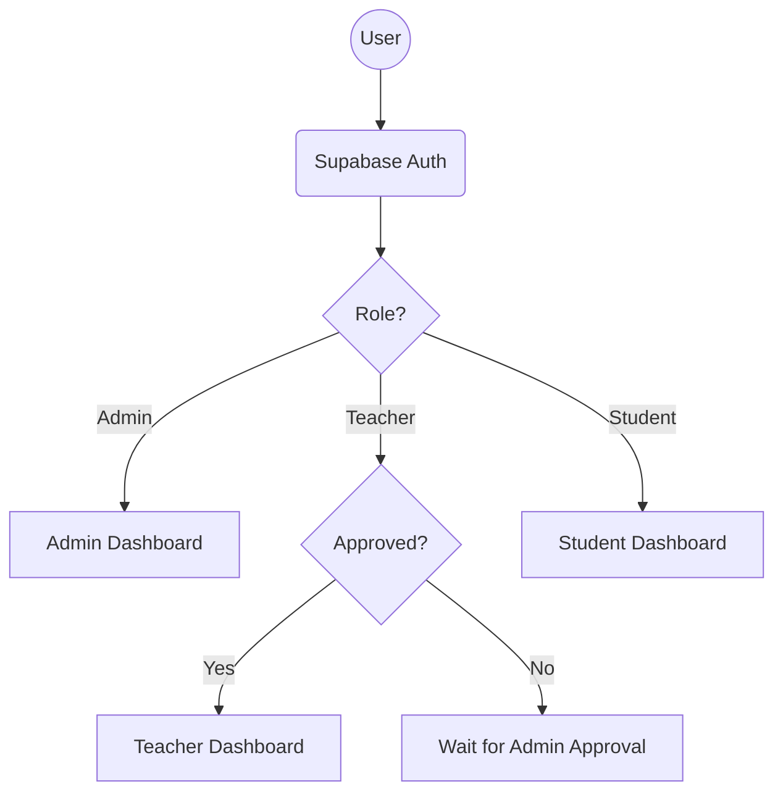

# Phân quyền & RBAC System (Miora Académie)
Created: 2026-04-12
Status: 🟡 Proposal

## 1. Executive Summary
Hệ thống quản lý điểm thi, học tập và bài tập trên Miora Académie cần một cơ chế phân quyền (RBAC) rõ ràng cho 3 vai trò chính: Admin, Giáo Viên, và Học Viên. Hệ thống cũng tích hợp cơ chế "Streak" (Chuỗi ngày học tập) để thúc đẩy động lực học tập của học viên.

## 2. User Stories
### Admin
- **Là Admin**, tôi muốn toàn quyền quản lý hệ thống.
- **Là Admin**, tôi muốn tạo, sửa, xóa tài khoản (cần nhập Tên + Email khi tạo).
- **Là Admin**, tôi muốn phê duyệt tài khoản giáo viên lần đầu đăng nhập.
- **Là Admin**, tôi muốn gán học viên cho giáo viên cụ thể.
- **Là Admin**, tôi muốn quản lý danh sách lớp (giáo viên nào đang có học viên nào).
- **Là Admin**, tôi muốn quản lý toàn bộ dữ liệu học viên/giáo viên.
- **Là Admin**, tôi muốn tạo/chỉnh sửa kho đề và ngân hàng bài tập.
- **Là Admin**, tôi muốn nhận email/notification khi học viên nộp bài hoặc giáo viên chấm bài.

### Giáo Viên
- **Là Giáo viên**, tôi muốn chỉ xem được danh sách học viên mà Admin phân công.
- **Là Giáo viên**, tôi không được tự ý thêm học viên mới hay tự gán học viên.
- **Là Giáo viên**, tôi không được chỉnh sửa kho đề/ngân hàng bài tập gốc của Admin.
- **Là Giáo viên**, tôi muốn chọn và giao bài từ kho đề cho học viên của mình.
- **Là Giáo viên**, tôi muốn đặt deadline cho mỗi bài tập.
- **Là Giáo viên**, tôi muốn chấm điểm, sửa bài và gửi feedback cho học viên.
- **Là Giáo viên**, tôi muốn theo dõi tiến độ của học viên do mình quản lý.
- **Là Giáo viên**, tôi muốn nhận email/notification khi học viên của mình nộp bài.
- **Là Giáo viên**, mỗi khi tôi đăng nhập, hệ thống sẽ hiện thông báo: "Hoạt động đăng nhập của bạn vừa được thông báo tới admin."

### Học Viên
- **Là Học viên**, tôi chỉ có quyền truy cập vào Personal Dashboard của bản thân.
- **Là Học viên**, tôi muốn xem danh sách bài cần làm hôm nay.
- **Là Học viên**, tôi muốn xem danh sách bài sắp đến hạn.
- **Là Học viên**, tôi muốn xem các bài chưa hoàn thành (quá hạn/chưa nộp).
- **Là Học viên**, tôi muốn làm bài, nộp bài, xem feedback và xem điểm bài đã chấm.
- **Là Học viên**, tôi muốn theo dõi tiến độ và hành trình học tập của mình.
- **Là Học viên**, tôi muốn nhận notification khi có bài mới, bài được chấm, feedback mới, sắp đến hạn, quá hạn, hoặc sắp mất chuỗi Streak.

## 3. Streak System (Hệ thống chuỗi)
- **Cơ chế +1 Streak**: Học viên nhận được +1 streak vào chuỗi hiện tại nếu trong ngày (theo timezone VN) có ít nhất 1 hoạt động hợp lệ:
  - Nộp ít nhất 1 bài tập.
  - Xem một bài feedback của giáo viên.
- **Cảnh báo mất Streak**: Hệ thống tự động kiểm tra và gửi notification/cảnh báo trước 6 tiếng so với 12h đêm VN (tức 18h00 giờ VN) nếu học viên chưa có hoạt động hợp lệ nào trong ngày.

## 4. Database Design (Core Tables cho RBAC)
_Chi tiết sẽ được thực hiện trong quá trình design, đề xuất sơ bộ:_
- `users`: ID, email, full_name, role (ADMIN, TEACHER, STUDENT), status (PENDING_APPROVAL, ACTIVE)
- `teacher_students`: teacher_id, student_id
- `assignments`: teacher_id, student_id, exam_id, deadline_at, status
- `submissions`: student_id, assignment_id, submitted_at, feedback, graded_by
- `streaks`: student_id, current_streak, highest_streak, last_activity_date
- `notifications`: user_id, message, type, read_status, created_at

## 5. Logic Flowchart (Sơ bộ)

## 6. Sơ đồ các luồng chính
- **Admin**: Quản lý accounts -> Assign Teacher <-> Students -> Quản lý Exams.
- **Teacher**: Xem Students -> Giao việc (Assign Exam) -> Students làm bài -> Chấm bài.
- **Student**: Làm việc (Do Exam) -> Submit -> Cập nhật Streak.
